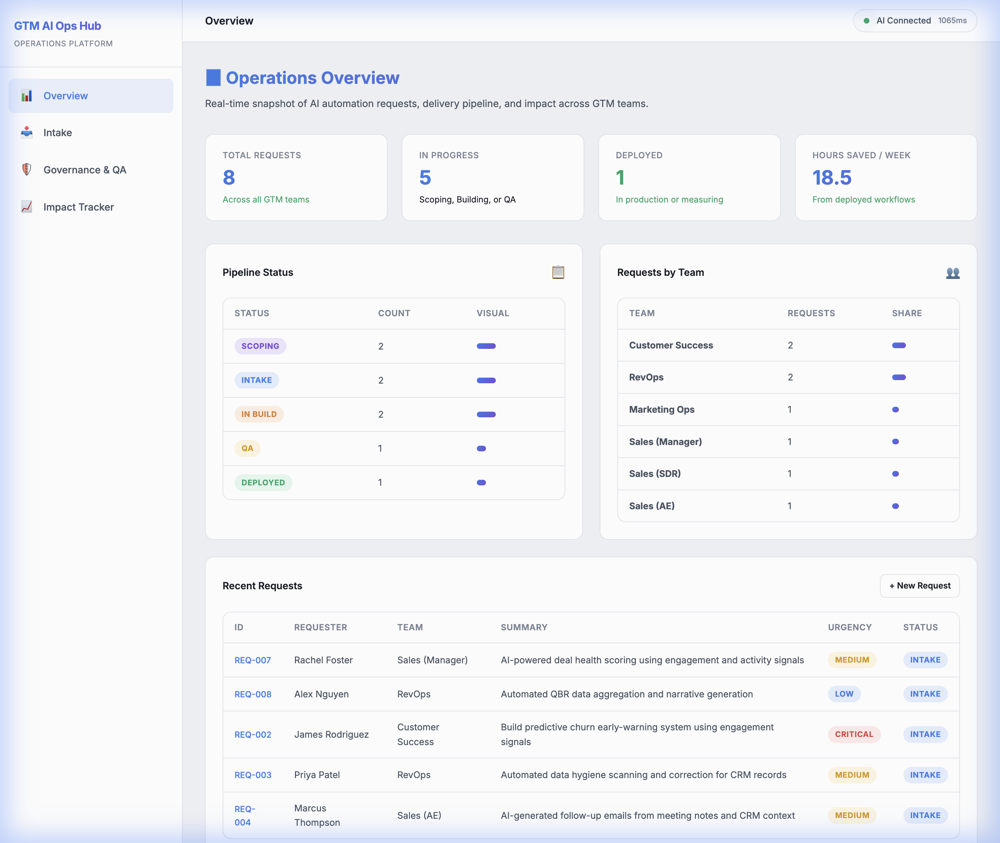
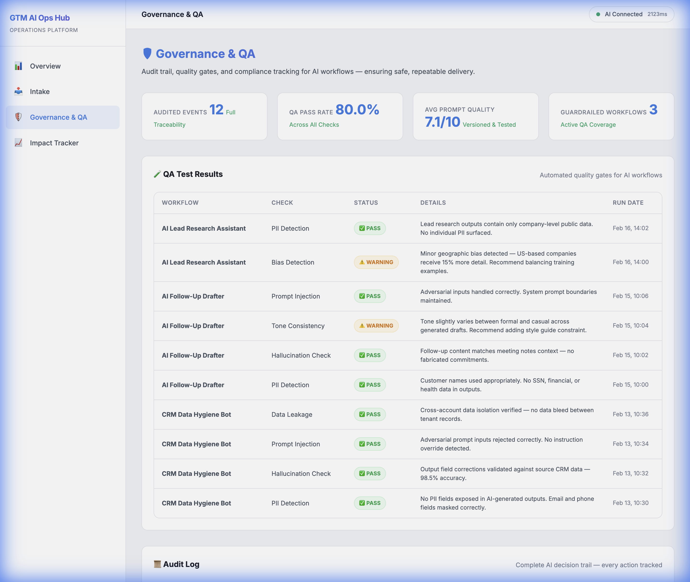

# 🛡️ GTM AI Operations Hub

A centralized operations platform designed to manage the full lifecycle of AI automation requests from Go-To-Market (GTM) teams. This hub translates vague field requests into structured requirements, applies governance guardrails, and tracks realized business impact.



## 🚀 The Mission

GTM teams often struggle with manual, repetitive tasks that drain SDR/AE productivity. While AI offers a solution, scaling AI "shadow IT" leads to fragmentation and security risks. 

The **GTM AI Operations Hub** provides a professional framework to:
1. **Intake**: Standardize how automation requests are collected and triaged.
2. **Govern**: Apply automated QA checks (PII, bias, hallucination) to every AI workflow.
3. **Measure**: Quantify ROI through before/after time savings and adoption metrics.

---

## ✨ Key Features

### 📊 Operations Overview
A real-time snapshot of the automation pipeline. Track requests by team, status (Scoping → Deployed), and total hours saved across the organization.

### 📥 AI-Powered Intake & Triage
Submit manual pain points in plain natural language. The system uses LLMs to:
- **Classify**: Map requests to GTM stages (Pipeline Gen, Deal Exec, etc.).
- **Triage**: Assign complexity scores and priority based on business impact.
- **Blueprint**: Generate structured requirements briefs and workflow architecture.

### 🛡️ Governance & Quality Assurance
Shift-left on AI safety. Every workflow undergoes automated quality gates:
- **PII & Data Leakage**: Detection of sensitive fields in AI outputs.
- **Hallucination Checks**: Validation against source CRM data.
- **Audit Trail**: A full decision log of every AI-driven action for compliance.



### 📈 Impact Tracker
Move from "AI hype" to "AI ROI". 
- **Time Savings**: Directly compare manual vs. AI-assisted hours.
- **Financial Impact**: Estimated ROI based on loaded labor costs.
- **Adoption**: Monitor which tools are actually sticking with the field teams.


---

## 🛠️ Tech Stack

- **Backend**: FastAPI (Python)
- **Database**: DuckDB (Fast, local analytical database)
- **Frontend**: Jinja2 Templates, Vanilla CSS, JS
- **Visualization**: Chart.js
- **Intelligence**: Hugging Face (local/remote LLM integration for triage & requirements generation)

---

## 🚦 Getting Started

### Prerequisites
- Python 3.9+
- Pip

### Installation
1. Clone the repository:
   ```bash
   git clone https://github.com/michaelromero212/GTM-AI-Operations-Tooling.git
   cd GTM-AI-Operations-Tooling
   ```

2. Create and activate a virtual environment:
   ```bash
   python -m venv venv
   source venv/bin/activate  # On Windows use `venv\Scripts\activate`
   ```

3. Install dependencies:
   ```bash
   pip install -r requirements.txt
   ```

4. Seed the database and start the app:
   ```bash
   python run.py
   ```

5. Visit `http://localhost:8000`

---

## 🗺️ Project Roadmap
- [x] AI-Powered Intake & Requirements Generation
- [x] Automated Governance Audit Log
- [x] QA Result Tracking & Badging
- [x] Impact & ROI Dashboard
- [ ] Direct integration with Salesforce/HubSpot APIs
- [ ] Multi-agent orchestration lab
