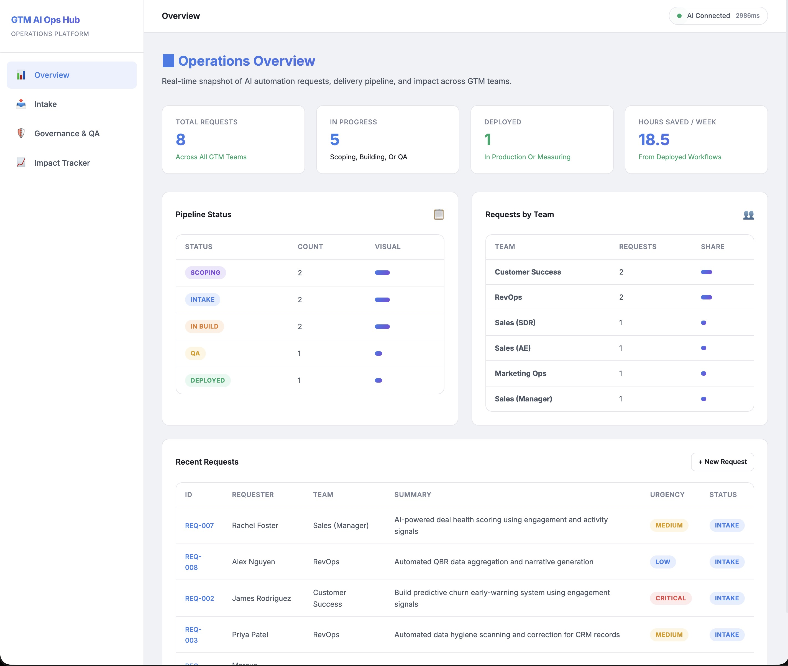
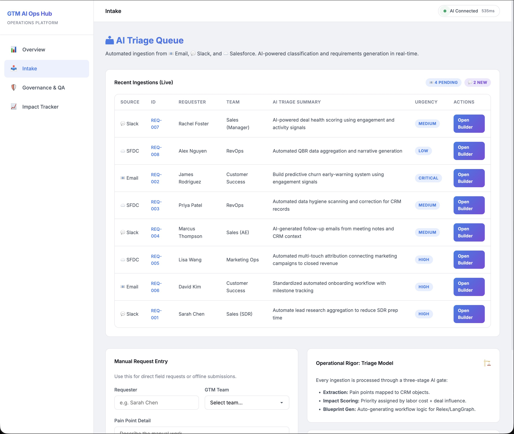
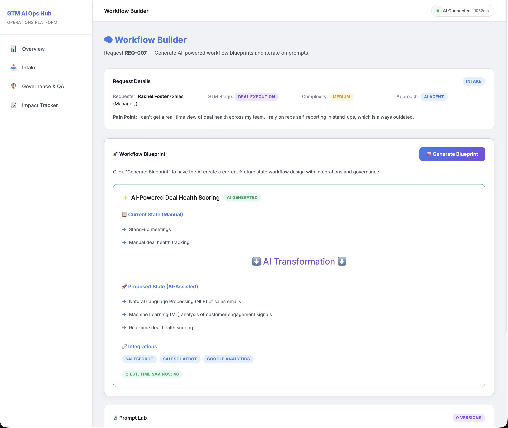
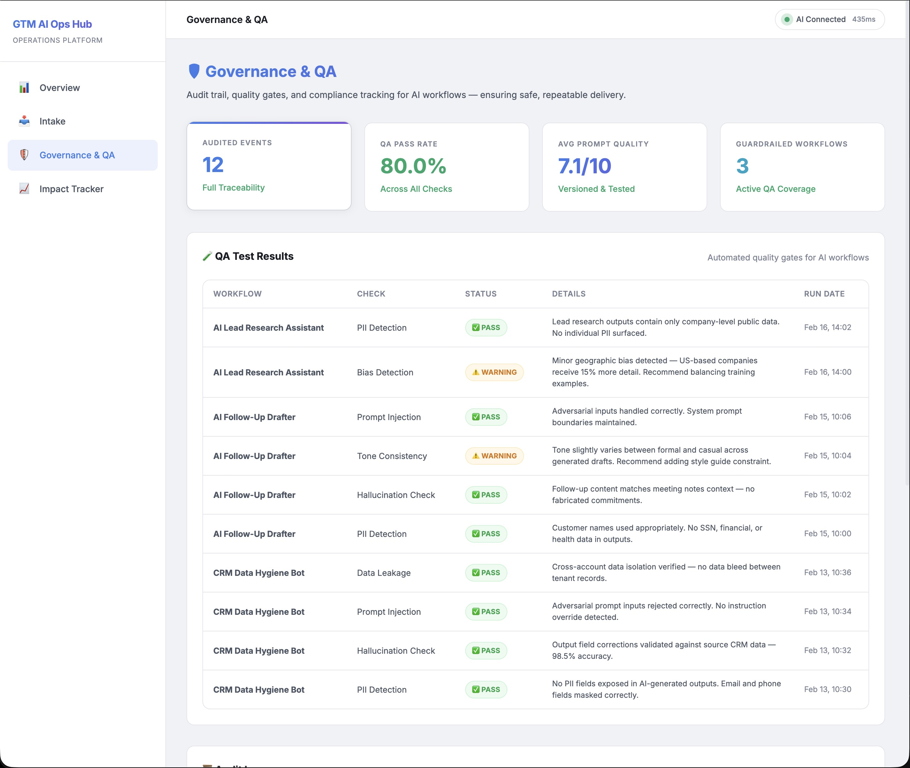
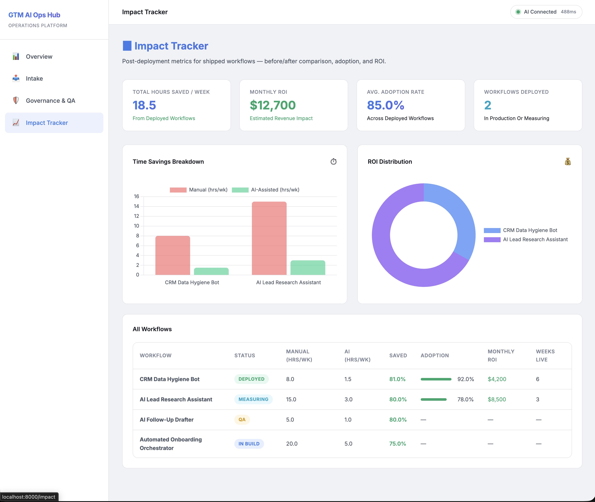

# 🛡️ GTM AI Operations Hub

A centralized operations platform designed to manage the full lifecycle of AI automation requests from Go-To-Market (GTM) teams. This hub translates vague field requests into structured requirements, applies governance guardrails, and tracks realized business impact.



## 🚀 The Mission

GTM teams often struggle with manual, repetitive tasks that drain SDR/AE productivity. While AI offers a solution, scaling AI "shadow IT" leads to fragmentation and security risks. 

The **GTM AI Operations Hub** provides a professional framework to:
1. **Intake**: Standardize how automation requests are collected and triaged using AI.
2. **Govern**: Apply automated QA gates (PII, bias, hallucination) to move quickly without breaking things.
3. **Measure**: Quantify ROI through before/after time savings to prove value to leadership.

---

## ✨ Key Features

### 📊 "Data in Motion" Overview
A real-time snapshot of the automation pipeline. Featuring a **Live Event Stream** that captures every AI decision, security check, and workflow update as it happens—echoing Confluent's core philosophy of treating data as a continuous stream.

### 📥 Automated AI Triage Queue
The control center for requests ingested from **📧 Email, 💬 Slack, and ☁️ Salesforce**. 
- **AI Classification**: Automatically maps requests to Confluent GTM stages (Pipeline Gen, Deal Exec, Onboarding & Adoption, Expansion & Renewal).
- **Triage Model**: AI assigns complexity scores and priority based on business impact and labor influence.



### 🧠 Workflow Builder & Blueprinting
Once a request is triaged, the hub generates a comprehensive **Workflow Blueprint**. This translates the business pain point into a technical architecture, mapping out integration touchpoints, automated quality gates, and projected time savings.



### 🛡️ Operational Rigor & Governance
Enterprise-grade safety for AI workflows. Every task passes through automated quality gates:
- **QA Badging**: Real-time results for PII Detection, Bias Monitoring, and Hallucination Checks.
- **Traceable Audit Log**: A full immutable decision trail for every AI-driven action.



### 📈 Impact Tracker
Move from "AI hype" to "AI ROI". 
- **Direct ROI Visualization**: Compare manual vs. AI-assisted labor costs.
- **Workflow Adoption**: Track which AI tools are driving the most efficiency for the field.




---

## 🛠️ Tech Stack

- **Backend**: FastAPI (Python)
- **Database**: DuckDB (Fast, local analytical database)
- **Frontend**: Jinja2 Templates, Vanilla CSS, JS
- **Visualization**: Chart.js
- **Intelligence**: Hugging Face (local/remote LLM integration for triage & requirements generation)

---

## 🚦 Getting Started

### Prerequisites
- Python 3.9+
- Pip

### Installation
1. Clone the repository:
   ```bash
   git clone https://github.com/michaelromero212/GTM-AI-Operations-Tooling.git
   cd GTM-AI-Operations-Tooling
   ```

2. Create and activate a virtual environment:
   ```bash
   python -m venv venv
   source venv/bin/activate  # On Windows use `venv\Scripts\activate`
   ```

3. Install dependencies:
   ```bash
   pip install -r requirements.txt
   ```

4. Seed the database and start the app:
   ```bash
   python run.py
   ```

5. Visit `http://localhost:8000`

---

## 🗺️ Project Roadmap
- [x] AI-Powered Intake & Requirements Generation
- [x] Automated Governance Audit Log
- [x] QA Result Tracking & Badging
- [x] Impact & ROI Dashboard
- [ ] Direct integration with Salesforce/HubSpot APIs
- [ ] Multi-agent orchestration lab
