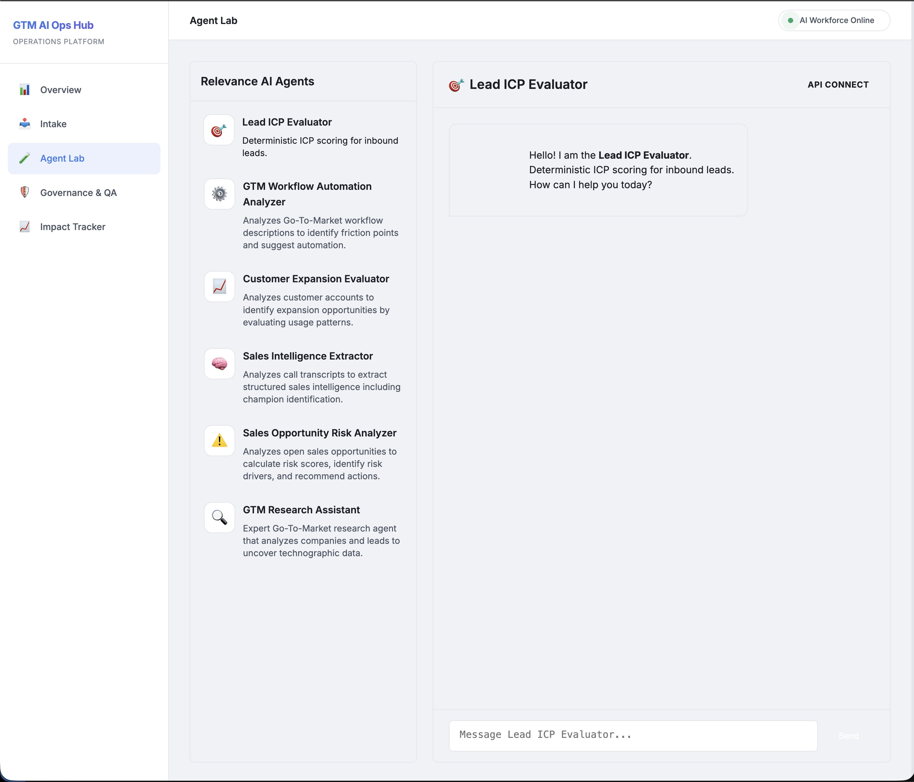

# 🛡️ GTM AI Operations Hub

A centralized operations platform designed to manage the full lifecycle of AI automation requests from Go-To-Market (GTM) teams. This hub translates vague field requests into structured requirements, applies governance guardrails, and tracks realized business impact.

## 🚀 The Mission

GTM teams often struggle with manual, repetitive tasks that drain SDR/AE productivity. While AI offers a solution, scaling AI "shadow IT" leads to fragmentation and security risks.

The **GTM AI Operations Hub** provides a professional framework to:
1. **Intake**: Standardize how automation requests are collected and triaged using AI.
2. **Govern**: Apply automated QA gates (PII, bias, hallucination) to move quickly without breaking things.
3. **Measure**: Quantify ROI through before/after time savings to prove value to leadership.

---

## 📸 Screenshots

### 1. Operations Overview
The main dashboard gives an at-a-glance view of the entire AI automation pipeline — total requests, items in progress, deployed workflows, and hours saved per week. The Pipeline Status table and Live Event Stream update in real time as requests move through the system, echoing Confluent's core philosophy of treating data as a continuous stream.


---

### 2. AI Triage Queue (Intake)
The intake page is the entry point for all automation requests. Field teams submit pain points via a manual form (or automated ingestion from Email, Slack, and Salesforce). The AI agent immediately classifies the request by GTM stage, complexity, and recommended approach, then routes it to the backlog.


---

### 3. Workflow Builder
After triage, each request gets a dedicated Workflow Builder page. This is where the AI generates a full technical blueprint — detailing integration points, step-by-step workflow logic, automated QA gates, and projected time savings. Engineers and ops teams use this as the source of truth for builds.


---

### 4. Agent Lab
A live chat interface for interacting with specialized **Relevance AI agents**, each purpose-built for a specific GTM motion — from scoring inbound leads against ICP criteria to extracting structured intelligence from call transcripts. Agents are connected via the Relevance AI Workforce API and respond in real time.



---

### 5. Governance & QA
Every deployed AI workflow passes through an automated QA gate before going live. This page surfaces the full audit log of AI decisions alongside QA check results — PII detection, hallucination checks, prompt injection tests, and bias scans — giving leadership a clear compliance and safety record.


---

### 6. Impact Tracker
The Impact Tracker closes the loop by quantifying the ROI of each deployed workflow. It compares manual hours before vs. AI-assisted hours after, tracks weekly adoption rates, and rolls up to a total dollar ROI — turning operational work into a measurable business case.


---

## ✨ Key Features

- **📊 "Data in Motion" Overview** — Real-time pipeline snapshots with a live audit event stream.
- **📥 Automated AI Triage Queue** — AI classifies requests by GTM stage, complexity, and priority.
- **🧠 Workflow Builder & Blueprinting** — Auto-generates full technical blueprints from a plain-language pain point.
- **🤖 Agent Lab** — Live Relevance AI agent chat for specialized GTM tasks (ICP scoring, transcript analysis, risk detection).
- **🛡️ Governance & QA** — Automated PII, hallucination, bias, and prompt injection checks with a full audit trail.
- **📈 Impact Tracker** — Before/after ROI measurement and workflow adoption tracking.

---

## 🛠️ Tech Stack

| Layer | Technology |
|---|---|
| Backend | FastAPI (Python) |
| Database | DuckDB |
| Frontend | Jinja2, Vanilla CSS, JS |
| Visualization | Chart.js |
| LLM Intelligence | Hugging Face Inference API |
| AI Agents | Relevance AI Workforce |

---

## 🚦 Getting Started

### Prerequisites
- Python 3.9+
- Pip

### Installation

1. Clone the repository:
   ```bash
   git clone https://github.com/michaelromero212/GTM-AI-Operations-Tooling.git
   cd GTM-AI-Operations-Tooling
   ```

2. Create and activate a virtual environment:
   ```bash
   python -m venv venv
   source venv/bin/activate  # On Windows: venv\Scripts\activate
   ```

3. Install dependencies:
   ```bash
   pip install -r requirements.txt
   ```

4. Set up environment variables:
   ```bash
   cp .env.example .env
   # Open .env and fill in your API keys
   ```

5. Start the app:
   ```bash
   python run.py
   ```

6. Visit `http://localhost:8000`

---

## 🗺️ Project Roadmap
- [x] AI-Powered Intake & Requirements Generation
- [x] Automated Governance Audit Log
- [x] QA Result Tracking & Badging
- [x] Impact & ROI Dashboard
- [x] Relevance AI Agent Lab integration
- [ ] Direct integration with Salesforce/HubSpot APIs
- [ ] Multi-agent orchestration lab
